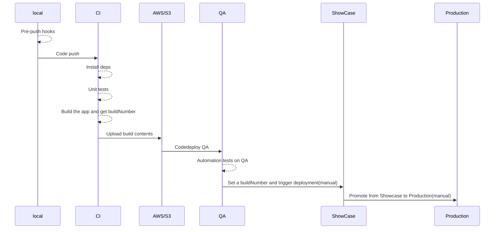

# gdhi-app-version-2

[](https://github.com/healthenabled/gdhi-app-version2/actions/workflows/build.yml)

The App is build using `Vue2`, `Vite` and `Vitest`.
It uses `Yarn@2` as a package manager and `github actions` for CI/CD.

## Table of Contents

1. **[Pre-requisites](#pre-requisites)**
2. **[Build Dependencies](#build-dependencies)**
3. **[Dev Dependencies](#dev-dependencies)**
4. **[Running the app locally](#running-the-app-locally)**
5. **[Building the app for production](#building-the-app-for-production)**
6. **[Unit testing](#unit-testing)**
7. **[Linting](#linting)**
8. **[Project Overview](#project-overview)**
8. **[Application Structure](#application-structure)**
9. **[Deployment](#deployment)**
10. **[Troubleshooting](#troubleshooting)**

## Pre-requisites

- ### Install nvm

  `nvm` allows you to quickly install and use different versions of `node` via the
  command line.

- ### Install `yarn`

  #### Install via `npm`

  It is recommended to install `yarn` through the `npm` package manager, which comes bundled with `Node`.
  Once you have npm installed you can run the following both to install and upgrade `Yarn`:

  ```sh
  nvm use
  npm install --global yarn
  ```

  <br/> To verify the installation:

  ```sh
  yarn  --version
  ```

  We are using `yarn` version 3.X in our project.

## Build Dependencies:

Some build dependencies of the project inlude:

- [Vue2](https://v2.vuejs.org/) as FE framework of choice.
- [axios](https://github.com/axios/axios/) for API calls.
- [chartjs](https://www.chartjs.org/) chart utils.
- [leaflet](https://leafletjs.com/reference.html) for displaying Maps.
- [papaparse](https://www.papaparse.com/docs) and [yup](https://github.com/jquense/yup) for csv pasrsing and validations.
- [pdf-lib](https://github.com/Hopding/pdf-lib) for Browser pdf genration.
- [vue-gtag](https://github.com/MatteoGabriele/vue-gtag/tree/1.0) for Google analytics integration. This depends on the following env variables:<br/>
  `VITE_IS_GOOGLE_ANALYTICS_ENABLED=true or false`
  
  `VITE_GOOGLE_ANALYTICS_ID={google analytics gid}`
- [Font-Awesome](https://fontawesome.com) as CSS style artifact for icons.

## Dev Dependencies:

Some dev dependencies of the project inlude:

- [Vite](vitejs.dev/) as FE Bundler of choice.
- [husky](https://typicode.github.io/husky/#/) for pre-push checks.
- [eslint](https://eslint.org/) for linting.
- [prettier](https://prettier.io/) for formatting.
- [vitest](vitest.dev/) for unit testing
- [vue-test-utils](v1.test-utils.vuejs.org/) for Vue component testing

For running locally, we want to keep the Enabled flag as False

## Running the app locally:

- To run the app locally install dependencies first:
  ```sh
  yarn install
  ```
- Once installed, run:
  ```sh
  yarn dev
  ```
  The above command will run the `Vite` dev server locally. This relies on the backend running on port 8888
- To change the configurations update the same in `vite.dev.config.js`

## Building the app for production:

- To build the app for production run:
  ```sh
  yarn build
  ```
- To preview the built artifacts run:
  ```sh
  yarn preview
  ```
  The above will point to a backend server running locally. Change the `vite.prod.config.js` to a local running `api` server to preview the built artifact successfully.
- We have a [chunking logic](https://github.com/healthenabled/gdhi-app-version2/blob/main/build/vite.prod.config.js#L13-L27) in `vite.prod.config.js` which creates and splits vendor chunks.
- We need to copy the map vectors artifact. This is a `json` file that [needs to be copied explicitly](https://github.com/healthenabled/gdhi-app-version2/blob/main/build/vite.prod.config.js#L56-L63).
- An [SRI plugin](https://github.com/healthenabled/gdhi-app-version2/blob/main/build/vite.prod.config.js#L66-L73) runs in the `post` pipeline of `Vite` to add `SRI` values for all assets.

## Unit testing

- We use `Vitest` and `vue-test-utils` for unit testing:
  ```sh
  yarn test
  ```
- We also use `c8` to capture coverage:
  ```sh
  yarn test:coverage
  ```
- Leverage `Vitest  UI` using:
  ```sh
  yarn test:ui
  ```

## Linting

- We use `eslint` with `vite recommendations` :
  ```sh
  yarn lint
  ```

## Project overview
- This is the `Vue2` UI repo for [GDHM](index.digitalhealthindex.org/). 
- The project provides a platform to upload digital health metrices of various Countries globally and a way to visualize them. 
- We have **yearwise** segregation of data to allow comparisons across years.
- We also have **Regions** which are composed of Countries
- We rely on backend as our source of truth and use the UI for only minor data changes before rendering it on the UI

## Application Structure
- The App follows a normal `Vue` structure with [`Components`](https://github.com/healthenabled/gdhi-app-version2/tree/main/src/components) containing most of View logic.
- The [`__tests__`](https://github.com/healthenabled/gdhi-app-version2/tree/main/src/components/__tests__) directory contains `Vitest` based unit tests and some interaction tests.
- We use Front-end generated `pdf` logic powered by `pdf-lib`. The meat of this code is in [`pdfhelper`](https://github.com/healthenabled/gdhi-app-version2/tree/main/src/components/pdfHelper) directory.
- We have created a [util for chunking and paginating](https://github.com/healthenabled/gdhi-app-version2/blob/main/src/components/pdfHelper/pdfUtils.js#L82-L104) for PDF generation.
- We also use `chartJs`, `papaparse` and `yup` for Charts, CSV parsing and validations respectively.
- We use `Vue-router` for [defining our paths and common components](https://github.com/healthenabled/gdhi-app-version2/blob/main/src/router/index.js).
- We don't use a state management library.We are using event bubbling in most cases with `window.appPropeties` to share state across components.
- We are also using `i10n` - some of these translations are found [here](https://github.com/healthenabled/gdhi-app-version2/tree/main/src/static-content), while for others we rely on the backend.
- We don't have API end points configured on the UI side, rather the BE app is assumed to be running on the same instance as the UI app. More of it in deployment section below
- We are using `scss` for our CSS pre-processing.
- Most of our CSS files are in the [stylesheets](https://github.com/healthenabled/gdhi-app-version2/tree/main/src/assets/stylesheets) directory from v1.
- We are also using `mixin` based logic for [RTL](https://github.com/healthenabled/gdhi-app-version2/blob/main/src/assets/stylesheets/_rtl-support.scss) language support.
- `scss` support comes in-built in `Vite` so [no additional configurations](https://vitejs.dev/guide/features.html#css-pre-processors) needed for the same.
- We have a [start-server script](https://github.com/healthenabled/gdhi-app-version2/blob/main/scripts/start_server.sh) that starts the `httpd` server instance on depoyment.

## Deployment
- We have 3 `environments` of Deployment:
  - [QA](https://github.com/healthenabled/gdhi-app-version2/deployments/activity_log?environment=QA)
  - [Showcase](https://github.com/healthenabled/gdhi-app-version2/deployments/activity_log?environment=SHOWCASE) 
  - [Production](https://github.com/healthenabled/gdhi-app-version2/deployments/activity_log?environment=PROD)
- We use `github actions` to configure our CI. The code for the same can be found in [`.github/workflows`](https://github.com/healthenabled/gdhi-app-version2/tree/main/.github/workflows) directory. 
- Below is a sequence diagram for CI/CD of the application:

- We use an `httpd` server on `AWS` to start up as a reverse-proxy which serves the Web assets from `asset` directory.
- It also routes any requests with `api` to the backend application running on the same instance as a `jar` file.
## Troubleshooting:

While trying to run the app on your local, here are some of the problems you might be facing:

1.  Check that the `node` version is used via `nvm` or to use the same version as `.nvmrc1 file.
2.  ### nvm - not found

- In your terminal, run the nvm installer.
  For `v0.391` the command looks like below. Please check `nvm` documentation for the latest version:

  ```sh
  curl -o- https://raw.githubusercontent.com/nvm-sh/nvm/v0.39.1/install.sh | bash
  ```

  #### or

  ```sh
    wget -qO- https://raw.githubusercontent.com/nvm-sh/nvm/v0.39.1/install.sh | bash
  ```

  You can use `curl` or `wget` depending on the command available on your device.
  These commands will clone the nvm repository to a `~/.nvm` directory on your device.

- Update your profile configuration:<br/>
  The installation process from step 1 should also automatically add the `nvm` configuration to your profile.
  If it doesn't automatically add `nvm` configuration, you can add it yourself to your profile file:

  ```sh
     export NVM_DIR="$([ -z "${XDG_CONFIG_HOME-}" ] && printf %s "${HOME}/.nvm" || printf %s "${XDG_CONFIG_HOME}/nvm")" [ -s "$NVM_DIR/nvm.sh" ] && \. "$NVM_DIR/nvm.sh"
  ```

  This command above loads nvm for use.

- Reload the shell configuration
  With your profile configuration updated, now you will reload the configuration for your terminal to use:

  ```sh
    source ~/.bashrc`
  ```

  With this command executed, nvm is ready for you to use. You can confirm that nvm is installed correctly by running:

  ```sh
    nvm -v
  ```

  This should show the version of `nvm` installed.

- Use the specified node version in the repository

  ```sh
    nvm use
  ```
